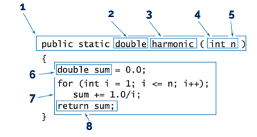

# EXAM: Programming Basics

### Getting Started
 - Fork this repository under your own account
 - Clone the forked repository to your computer
 - Create a `.gitignore` file so generated files won't be committed
 - Commit your progress frequently and with descriptive commit messages
 - All your answers and solutions should go in this repository

### What can I use?
- You can use any resource online, but **please work individually**
- **Don't just copy-paste** your answers and solutions, use your own words instead.
- **Don't push your work** to GitHub until your mentor announces that the time is up

# Tasks
## 1-3. Complete the following tasks:
- [Count characters](countchars/CountChars.cs)
- [Word reverser](wordreverser/Wordreverser.cs)
- [PokeBag](pokebag/PokeBag.cs)

### Acceptance criteria
The application is accepted if:
- The solution works according to specification [1p each]
- The solution follows [styleguide](https://github.com/greenfox-academy/teaching-materials/blob/master/styleguide/cs.md) [1p]
- Has proper error handling where the specification says it [1p each]
- Has the correct loops, methods, filters [1p each]
- The code is clean, without unnecessary repetition, and with descriptive names [1p each]
- You commit frequently with descriptive commit messages [1p]

## 4. Question time! (~10 mins) [4p]

###  What is inheritance? When would you use it? [2p]
#### Your answer:
[add your answer here]
- Inheritance enables you to create new classes (derived class) that reuse, extend, and modify the behavior
  that is defined in other classes (base class).
- We use this if we have a large group (plants), each one is green, but has different smell.

### Name each building block of a method! [2p]

#### Your answer:
[add your answer here]   
1:   signature
2:   return type
3:   method name
4:   argument type
5:   argument variable
6:   local variable
7:   method body
8:   return statment
